# Equity Liquidity Foundry (ELF)

**Design the market, not just the token.**

ELF is an issuer-facing market-design and liquidity-launch platform for
tokenized equities and pre-IPO assets on Solana, built on Meteora's
Dynamic Bonding Curve (DBC). It takes an issuer from "I have a tokenized
asset" to "I have a live, monitored, real Meteora market" through one
flow: **Discover an asset → Market Profile → Curve Compiler → Simulation
→ Config Review → Wallet Approval → Meteora DBC Config/Pool → Live
Market → Trade → Market Analytics → Graduation Monitor** — and, once
live, anyone can buy or sell directly against the deployed curve from
the market page itself, with the on-chain price compared against Pyth
feeds wherever the configured API key is entitled to them (otherwise the
page says exactly why it cannot).

> **Status — real and verified on Solana Devnet.** A real Meteora DBC market (ANDURIL / USDC) is deployed,
> real BUYs and SELLs were signed in a browser wallet (the latest ones through the HTTP-polling confirmation path),
> every one of them was read back from the chain and indexed, and the analytics, market-health and AI panels run on that indexed
> data. Simulations are labelled *"Simulation — no blockchain transaction is executed."* and are never shown as
> live data. Nothing here is mocked blockchain state. `pnpm test`: **59 files / 1002 tests passing**; typecheck,
> lint and production build are clean.

## Demo video

Recorded on the live deployment (https://web-rosy-six-kh0q1fz7se.vercel.app): sample issuer through all five
Design steps (Asset → Profile → Configuration → Simulation → Deploy), Asset Discovery, a PreStocks asset into the
wizard, and Live Markets. [Download the MP4](docs/demo/elf-working-demo.mp4).

**Contents:** [Demo video](#demo-video) · [Proven on Devnet](#proven-on-solana-devnet) · [Screenshots](#screenshots) ·
[Problem](#1-problem) · [Architecture](#4-architecture) · [Setup](#5-setup) ·
[Environment](#6-environment-variables) · [Testing](#8-testing) · [Deployment](#9-deployment) ·
[Security](#12-security-considerations) · [Known limitations](#13-known-limitations)

## Proven on Solana Devnet

Everything below is on **Solana Devnet** (genesis hash verified by the server before every transaction build and by
the browser before signing). Wallet (public address only): `5w4DDXyxyDGPvqZK51htobEpUSjdeh8QyCQe4LkKRzYC`.
Pool `5XeQcXNLoqeoVunzvAQpuxM8gXX3iKVwLZPywKkDn1tr` · config `FSAcLZu51beW2eFQPbqWq5HE5CzwdHjKLfQhyiMkHdkF` ·
base mint (ANDURIL) `DF2UiBQXEj3S3abpipV7EyNqz8fhrwZ3hTo5adaw8zkF` · quote mint (Circle devnet USDC)
`4zMMC9srt5Ri5X14GAgXhaHii3GnPAEERYPJgZJDncDU`.

| Step | Result | Explorer (Devnet) |
|---|---|---|
| Create config | finalized | [`25urS6H9…oMek6dh`](https://explorer.solana.com/tx/25urS6H9BacSrEP5P2LZaFTewdrCNELJvSd348otSRftyZiZZf93nKnmQuMnQ3UmwymCkoe9iccWTwbHXoMek6dh?cluster=devnet) |
| Create pool | finalized | [`2ndmXGS8…XQnVjY6`](https://explorer.solana.com/tx/2ndmXGS8hdmkjbXSSBPFe2gqXeF3pvgPvh4dPxUJnF8a4deRSbwtv5LxPHWAcq5FQpZTnLaHYpvMiU5ShXQnVjY6?cluster=devnet) |
| **Real BUY** | 1.000000 USDC → 3.046069748 ANDURIL (exactly the quote), fee 5,331 lamports, finalized, `err = null` | [`5iv2aKJ4…tM2d5zW`](https://explorer.solana.com/tx/5iv2aKJ4Nrx8UhXXB1QmGAginvSR8nagmATkRPioVE9984YYEXoHAsQN9jFGSs67ggZceGHMWPcCer9pztM2d5zW?cluster=devnet) |
| **Real SELL** | 1.000000000 ANDURIL → 0.321756 USDC (exactly the quote), fee 5,313 lamports, slot 501,034,451, finalized, `err = null`, one Meteora DBC `Swap` instruction, fee payer = the connected wallet | [`29oPaMAu…8y7Zvz3`](https://explorer.solana.com/tx/29oPaMAuErG2QTgSnjsw1vgXxs7dJ4Ac3Q78asFai8pMUcHxJfQFCeVAMibaaRtZs1dA1DWfCFHgZRZYN8y7Zvz3?cluster=devnet) |

The indexer holds **10 trades (6 BUY / 4 SELL)** for this pool. All 10 signatures were checked against the chain: every
one is finalized with `err = null`, the pool's only signature ELF does not index is the pool-creation transaction, and
the volumes shown in the app recompute exactly from the indexed rows. Full evidence, including what is *not* verified:
[docs/demo-evidence.md](docs/demo-evidence.md).

## Screenshots

Captured from the running app against Solana Devnet. Screenshots 03–08 use the built-in **sample issuer**
("Helios Aerodyne — Pre-IPO (Sample)") — a demo asset that is planned and simulated but not deployed. Screenshots 09–17 are
the real, deployed ANDURIL market.

### Discover and design

**1. Homepage** — the product in one screen: design the market, simulate it, deploy it, watch it.


**2. Asset discovery** — live PreStocks catalog, pulled from the provider's public API (not a cached snapshot).

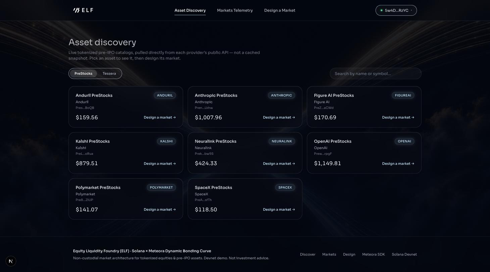

**3. Market Launch Copilot — compiled curve.** ELF's curve compiler produces three candidate configurations; the plan
shows the values the engines returned. Marked *Proposal* and *Deterministic · no AI*.

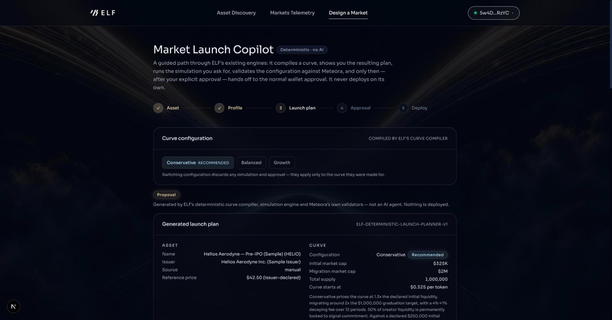

### Simulate

**4. Simulation and risk checks.** Six scenarios on Meteora's real curve math, labelled *"Simulation — no blockchain
transaction is executed."*, plus six pass / fail / unavailable checks (there is deliberately no risk score).

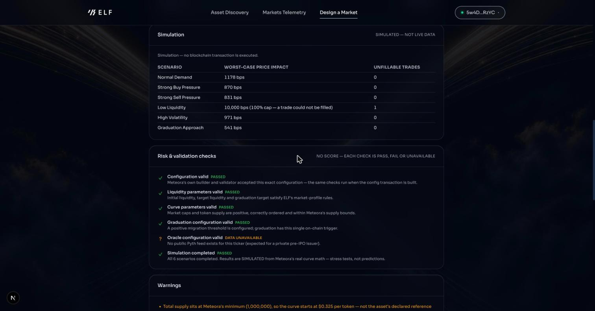

**5. Simulation Lab** — an off-chain scenario view of one stored configuration; every chart is tagged SIMULATED so it can
never pass for live data.

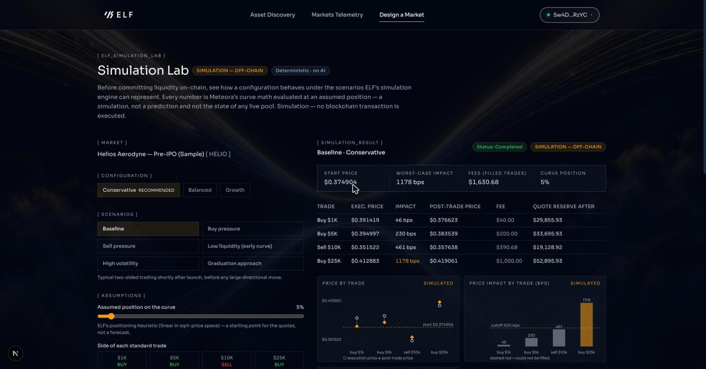

### Approve and deploy (nothing is signed by ELF)

**6. Launch readiness** reads real state (network, wallet, balance, plan, Meteora validation, existing deployment). Here
MetaMask is on Solana Mainnet, so the report says exactly why it is *Not ready* — ELF refuses to sign until the wallet is on
Devnet.

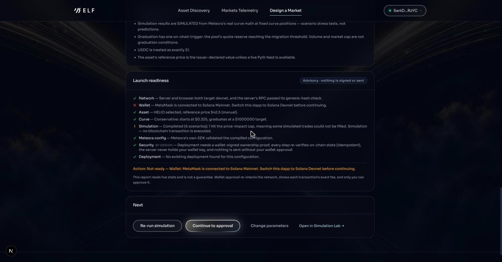

**7. Explicit approval** — the only route to wallet approval is an acknowledged, open gate.

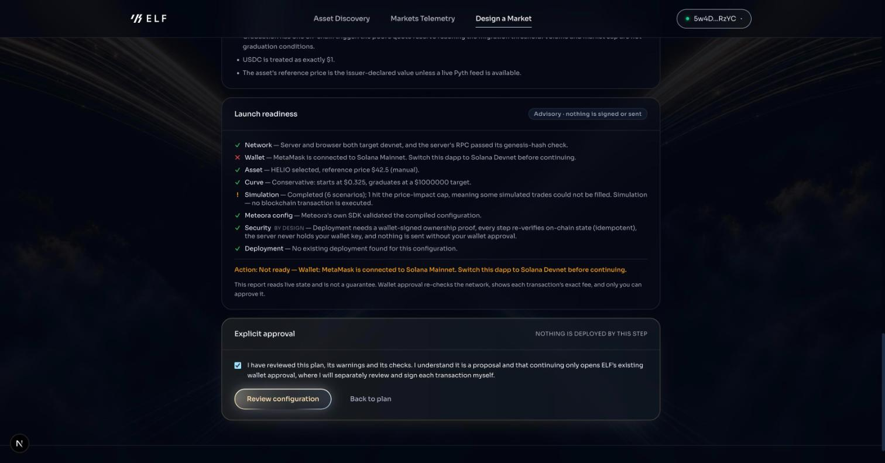

**8. Wallet approval & deployment (Step 5)** — two real Meteora DBC transactions, simulated before any signature prompt.
The network guard blocks signing while the wallet is on the wrong network. (Captured without approving anything.)

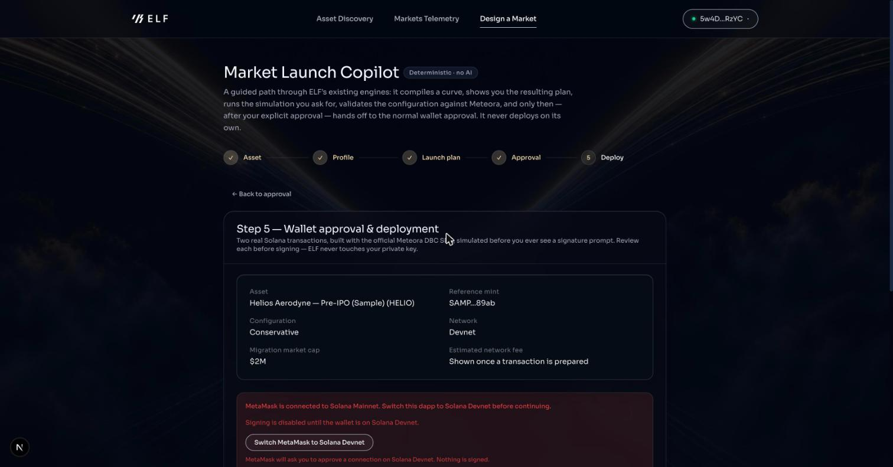

### The live market and the real trades

**9. Live market** — on-chain price, liquidity and graduation next to indexed volume and trades; every tile is labelled
ON-CHAIN or INDEXED, and the freshness badge shows how recent the index is.

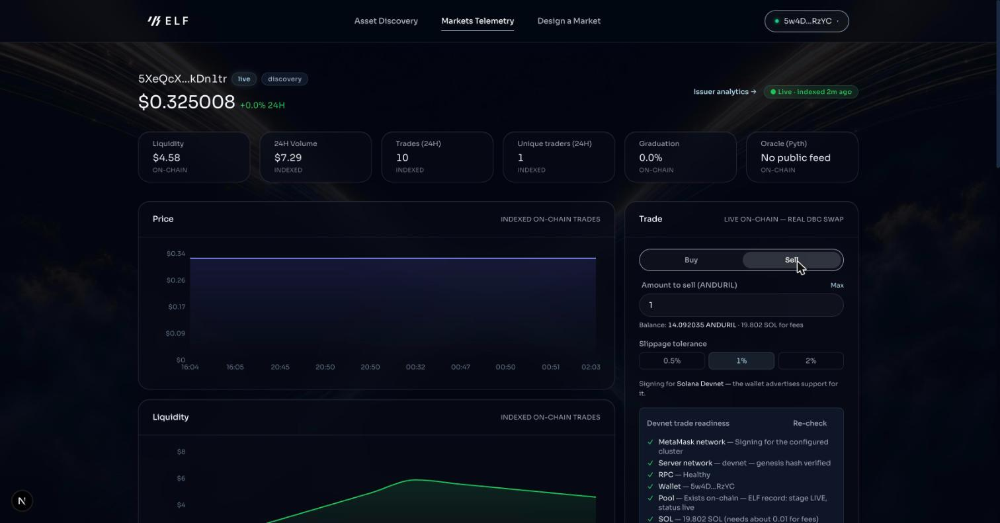

**10. Trade panel — SELL** — the readiness checklist is context-aware: for a SELL it checks the wallet's ANDURIL balance and
dry-runs a SELL, and only then reads *READY for SELL*. Read-only: nothing is signed or sent.

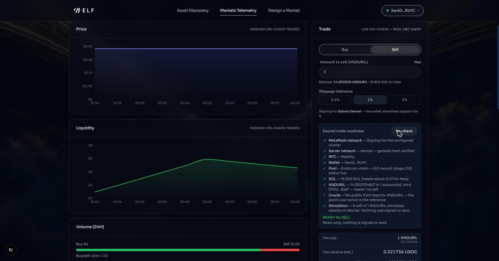

**11. Graduation monitor and price oracle** — graduation is the single real DBC condition (quote reserve vs migration
threshold); the oracle panel says plainly that ANDURIL has no public Pyth feed.

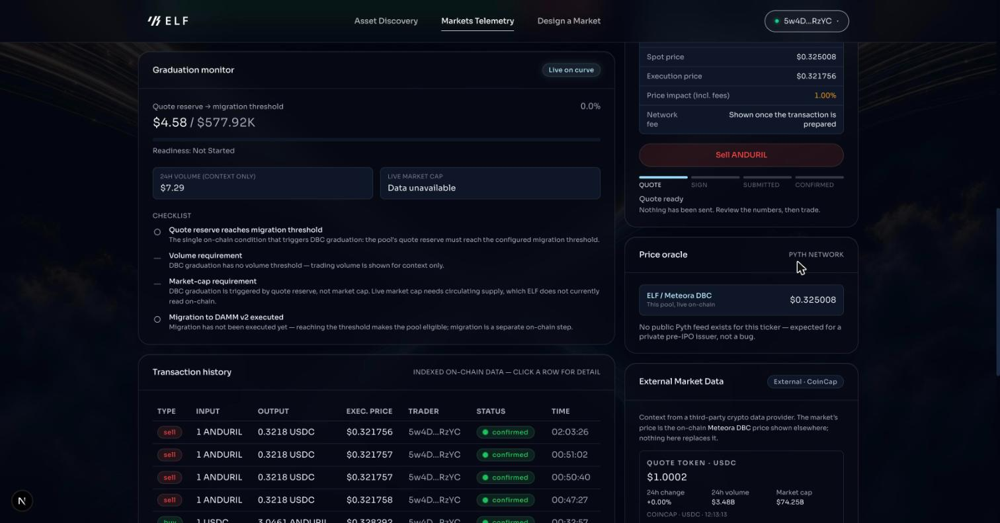

**12. Transaction history and external market data** — indexed on-chain trades with the signature, pool, network and a Solana
Explorer link. CoinCap is shown as *External* context only and reports "unavailable for this asset" for ANDURIL rather than
mapping it to another ticker.

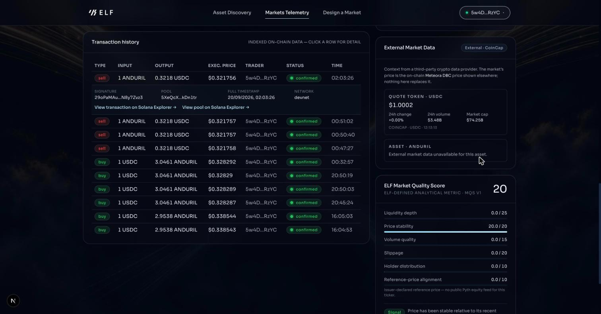

**13. Real BUY on Solana Explorer** — Success · Finalized, fee payer = the connected wallet.

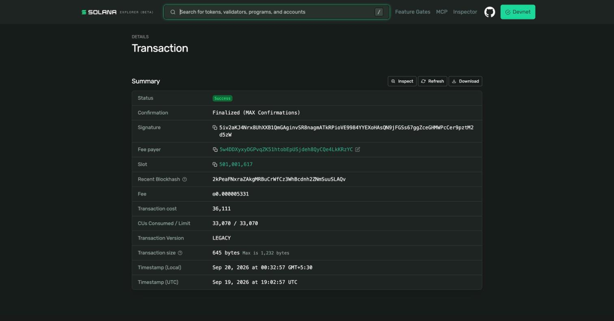

**14. Real SELL on Solana Explorer** — Success · Finalized, slot 501,034,451, fee ◎0.000005313.


### Analytics, health and AI

**15. Market health** — deterministic rules over indexed data (NORMAL / WATCH / DATA UNAVAILABLE, no score, no AI).

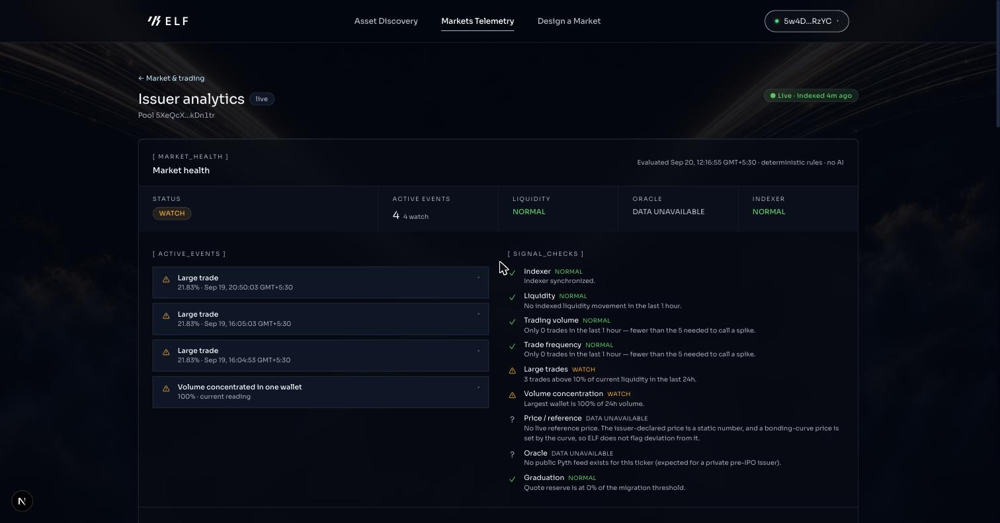

**16. AI Market Analysis (Groq)** — an explanation of a server-built snapshot of verified data, labelled *AI-generated · not a
source of truth*. Every number in it was checked against the snapshot.

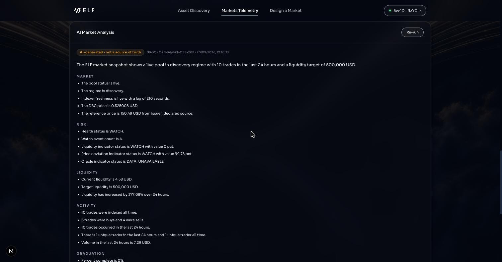

**17. Evidence and limitations** — the evidence list is written by the server, not the model.

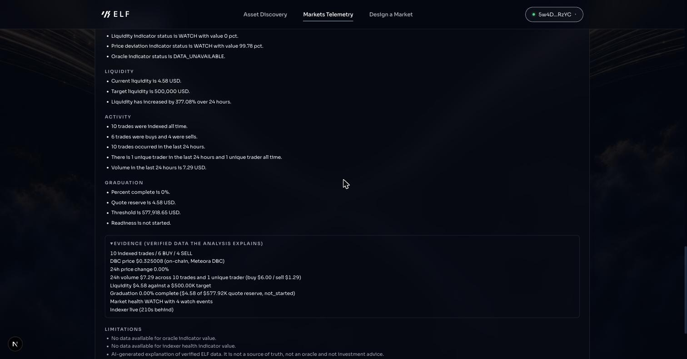

Built for the Solana "Stocklana" hackathon, targeting the Meteora DBC,
Pyth, and PreStocks bounties: a real, live integration into
**PreStocks** (both the asset-selection step and a standalone `/assets`
discovery page), a real, in-app **Meteora
DBC swap widget** (not just a launch tool), and a **multi-source Pyth
price oracle** built to compare the live on-chain price against the
regulated equity feed, the xStock feed, and the Ondo feed — live numbers
require a Pyth key entitled to those feeds; the key used in development is
authenticated but not entitled, so the panel reports
`Restricted — Pyth entitlement required` instead of showing a price. PreStocks is the
only pre-IPO token provider ELF integrates.

Clawpump's agent-launch bounty was evaluated and deliberately not
pursued: it requires launching a token on a separate third-party
platform, a different product surface from ELF's issuer-facing Meteora
flow, and bolting it on under time pressure would have diluted focus
from the bounties ELF is a strong fit for.

A guided, deterministic path through this same flow is available at
`/design/copilot` — see [Market Launch Copilot](#market-launch-copilot-designcopilot).

## 1. Problem

Tokenized securities can exist on Solana without a well-designed
secondary market. Spinning up a Meteora DBC pool requires understanding
curve math, fee schedules, migration thresholds, and liquidity
distribution — none of which an equity issuer should need to learn from
scratch, and none of which look anything like a memecoin launch when done
right.

## 2. Why Solana

Sub-second finality and sub-cent fees make a bonding-curve price-discovery
mechanism practical for assets that would otherwise need a market maker
or an off-chain order book to bootstrap liquidity. Meteora's DBC program
is a mature, audited, widely-used primitive on Solana specifically for
this problem.

## 3. Why Meteora DBC

Meteora's Dynamic Bonding Curve gives every launch a permissionless,
programmatic price-discovery curve with configurable fee schedules
(linear/exponential decay, dynamic fee), a defined migration path into a
permanent DAMM v2 pool once a quote-reserve threshold is reached, and
first-buy support so an issuer can seed price on deployment. ELF never
invents its own AMM math or account layout — every config, pool, and
quote in this product is built with the official
`@meteora-ag/dynamic-bonding-curve-sdk` (pinned at `1.5.12`). See
[docs/market-model.md](docs/market-model.md) for exactly which SDK
functions back which feature.

## 4. Architecture

See [docs/architecture.md](docs/architecture.md) for the full diagram and
data-flow walkthrough. Short version: a pnpm/Turborepo monorepo —
`apps/web` (Next.js 16, App Router) talks to seven workspace packages,
only one of which (`@elf/meteora-adapter`) ever imports the Meteora SDK
directly.

```
apps/web                   Next.js UI + API routes
packages/shared             Domain types + zod schemas
packages/market-engine      Curve compiler, market-quality scoring, graduation math
packages/simulation-engine  Scenario simulation against real curve math
packages/meteora-adapter    The only package touching the Meteora SDK
packages/solana             Connection/pubkey/well-known-mint helpers
packages/prestocks-adapter  Live PreStocks API integration
packages/db                 Prisma client + generated types
prisma/schema.prisma        Postgres schema
tests/                      market-engine, simulation, integration suites
docs/                       architecture.md, security.md, market-model.md
```

### Market Launch Copilot (`/design/copilot`)

A guided, **deterministic** front door to the same issuer workflow — not an
AI agent, and the Copilot itself never calls an LLM (the separate AI Market
Analysis panel below is the only language-model feature).
Flow: **Asset → Market design → Curve compilation → Simulation → Risk check →
Config review → Wallet approval → Meteora DBC.**

- **What it does.** Builds a transparent *launch plan* from values the
  existing engines already produce: the curve compiler's candidate, the
  simulation engine's results, Meteora's own `validateConfigParameters`
  (run on the exact parameters the deploy path would send), and the Pyth
  integration's real state. Every number is shown as the engine returned it;
  anything that could not be determined is shown as `DATA UNAVAILABLE`
  (a restricted Pyth feed reads `Restricted — Pyth entitlement required`).
- **Engines reused, none duplicated.** `AssetStep`, `ProfileStep`, the curve
  compiler, the simulation engine (`/api/markets/simulate`), the Pyth
  comparison, and the existing `ReviewStep` for wallet approval and deploy.
  There is no second compiler.
- **Simulation flow.** The plan first shows `Not run yet`. *You* press
  **Run simulation**; the stored result is then re-validated structurally
  (labelled `SIMULATED`, every scenario present, every number finite) before
  it counts.
- **Risk validation.** Six checks — configuration, liquidity parameters,
  curve parameters, graduation configuration, oracle configuration,
  simulation — each `pass`, `fail`, `unavailable` or `not_run`. There is
  deliberately **no risk score** and no invented threshold. Warnings appear
  only for concrete engine-reported conditions (e.g. the supply floor,
  a derived graduation threshold that differs from your declared target,
  trades the simulation could not fill).
- **Graduation** uses the single real DBC condition — quote reserve ≥ the
  migration threshold. The plan shows the threshold Meteora *derives* from
  the curve next to your declared target.
- **Only real parameters.** It exposes only what the backend supports; there
  is no "market duration".
- **Human approval is required.** Generate plan → review → run simulation →
  review checks → tick the acknowledgement → *Review configuration* → the
  existing wallet approval, where you still sign each transaction yourself.
  The step from plan to wallet approval is a reducer transition reachable only
  through an explicit approve event on an open gate; the plan route performs
  no database writes and no signing.
- **What it does NOT do.** It does not deploy, sign, hold keys, predict
  prices, give investment advice, or use an LLM. A plan is a proposal.
- **Launch readiness.** Below the plan, a read-only report checks the real current
  state: server/browser network (server genesis check), the connected wallet and
  its network, the wallet's real SOL balance against an ELF-defined minimum
  (`MIN_DEPLOYMENT_SOL`, a safety margin — not a protocol constant), the asset,
  the compiled curve, the simulation result, Meteora's own config validation and
  any existing deployment of the same configuration. The security line is marked
  "by design" because it describes the architecture rather than something
  measured. The action reads "Ready for wallet approval" only when nothing
  blocks. The report is advisory: it never signs or sends anything.

### AI Market Analysis and External Market Data

Two server-side integrations, both optional (the app works without either key):

- **AI Market Analysis** (`POST /api/ai/market-analysis`, panel on the issuer
  dashboard) — **Groq** explains a snapshot of *verified* ELF data (Meteora DBC
  on-chain state → ELF indexer → deterministic analytics → snapshot → Groq).
  Groq is never a source of truth: the body carries only a market id, the server
  builds the snapshot (numbers and enums only — no names, addresses or free text),
  and the model's answer is validated: strict JSON schema, every digit checked
  against the snapshot, advice/prediction language and addresses/links dropped.
  The evidence list ("9 indexed trades / 6 BUY / 3 SELL / DBC price …") is built
  by the server, not the model. The panel is labelled "AI-generated · not a source
  of truth". Model: `GROQ_MODEL` (default `openai/gpt-oss-20b`).
- **External Market Data** (`GET /api/market/external`, panel on the market page)
  — **CoinCap** prices the market's quote token (SOL / USDC) and, only when
  CoinCap lists an asset with the *same symbol and name*, the asset itself. An
  equity/pre-IPO asset that CoinCap does not list shows "External market data
  unavailable for this asset." — it is never mapped to another ticker. It never
  replaces the on-chain Meteora DBC price.

### Simulation Lab (`/design/lab`)

An **off-chain** scenario view of one stored configuration, run *before* any
liquidity is committed. It reuses the existing simulation engine — there is no
second engine — and never builds, signs or sends a transaction.

- **Supported scenarios** — exactly the six the engine defines: Baseline,
  Buy pressure, Sell pressure, Low liquidity (early curve), High volatility,
  Graduation approach.
- **Adjustable assumptions** — only what the engine genuinely varies: the
  assumed position on the curve (0–95%, ELF's positioning heuristic) and the
  side (buy/sell) of each of the four standard trades ($1k/$5k/$10k/$25k).
  The client names a *stored* curve configuration; it can never supply curve
  parameters.
- **Results** — per trade: execution price, price impact, post-trade price,
  fee and the quote reserve after the trade; three charts drawn only from that
  output (dashed, hatched and tagged SIMULATED so they can't pass for live
  charts); a **simulated graduation state** using the one real DBC condition
  (quote reserve reaching Meteora's migration threshold) via the existing
  `computeGraduationStatus`; and explainable risk checks (configuration valid,
  output valid, price impact, fillable, liquidity change) with live-only
  indicators shown as DATA UNAVAILABLE. No score.
- **Comparison** — completed runs of the *same* configuration side by side;
  runs of different configurations are refused as incompatible.
- **Replay** — completed runs are kept for the browser session only
  (`sessionStorage`); nothing is persisted server-side and no migration was
  added.
- **Simulation vs the chain** — a simulation is Meteora's curve math evaluated
  at an assumed position. It is not a forecast and not the state of any pool.
- **What it does NOT model** — volume increase (no volume series), free-form
  liquidity change (that is a different configuration — re-run the compiler),
  a price path over time (each trade is quoted independently from the start
  position), or trade counts beyond the four standard trades. These are listed
  in the UI rather than approximated.

### Market Health & Anomaly Engine (issuer analytics)

A monitoring layer on the existing issuer dashboard
(`/markets/[marketId]/analytics`) that keeps watching a market after launch.
Deterministic and rule-based: **not** a fraud detector, **not** an AI
prediction system, **not** financial advice.

- **States** — NORMAL / WATCH / DATA UNAVAILABLE. No score.
- **Events** — LIQUIDITY_DROP, VOLUME_SPIKE, TRADE_FREQUENCY_SPIKE,
  LARGE_TRADE, TRADE_CONCENTRATION, PRICE_DEVIATION, ORACLE_UNAVAILABLE,
  ORACLE_RESTRICTED, INDEXER_LAG, GRADUATION_REACHED — each with observed
  value, reference, cutoff, real timestamp (where the data has one), data
  source and a plain-language explanation. Only signals ELF can actually
  calculate are implemented (there is no pool-status history, so no
  "status transition" event).
- **Thresholds** — existing ELF cutoffs are reused (price deviation, large
  trade, concentration, indexer lag); the few new ones are explicit and
  documented in `docs/architecture.md`, and temporal signals are measured
  against the market's own history.
- **API** — `GET /api/markets/:id/health`; the same payload also ships inside
  the existing `/risk` response, so the dashboard adds no extra polling.

## 5. Setup

Prerequisites: Node 20+, pnpm, Docker (for local Postgres).

```bash
git clone <this repo>
cd "SPLANA HACATHON"
pnpm install
cp .env.example .env        # then fill in values, see below
docker compose up -d        # starts local Postgres on :5432
pnpm db:migrate              # applies prisma/schema.prisma
```

## 6. Environment variables

See [.env.example](.env.example) for the full, current list. Summary:

| Variable | Where used | Notes |
|---|---|---|
| `DATABASE_URL` | server only | Postgres connection string |
| `SOLANA_RPC_URL` | server only | may embed an API key; never sent to the browser. Used by every API route, the Meteora adapter and the indexer (route and CLI). The free public endpoint returns HTTP 429 under bursts (measured: 20 of 40 concurrent reads), so use a dedicated Devnet URL; it must contain `devnet`, and the server verifies the genesis hash |
| `NEXT_PUBLIC_SOLANA_RPC_URL` | browser | public endpoint, no secrets (it ships in the client bundle: use an origin-restricted key) |
| `NEXT_PUBLIC_APP_URL` | both | used to build token metadata URIs |
| `PRESTOCKS_API_URL` | server only | defaults to the live public PreStocks API |
| `PYTH_API_KEY` | server only | **required for live Price Oracle data.** Hermes's `/v2/updates/price/latest` requires a Bearer token as of the current API version (verified live — see Known limitations); without it, the panel renders its honest "not configured" state, never fake numbers |
| `GROQ_API_KEY` | **server only** | enables `POST /api/ai/market-analysis`. Never `NEXT_PUBLIC_`; never sent to the browser. Empty = the route reports "not configured" |
| `GROQ_MODEL` | server only | Groq model id for the AI analysis; defaults to `openai/gpt-oss-20b` (see console.groq.com/docs/models) |
| `COINCAP_API_KEY` | **server only** | enables `GET /api/market/external` (CoinCap v3). Never `NEXT_PUBLIC_`. Empty = the route reports "not configured" |
| `INDEXER_SECRET` | server only | Bearer token for `POST /api/indexer/run`. **Set it in every deployed environment**: when it is empty the route is open in local development only, and in production it fails closed (HTTP 500) |
| `TRUSTED_PROXY_HOPS` | server only | number of trusted reverse-proxy hops for the rate limiter's client identity (`0` = trust no client header; Vercel: `1`) |
| `PYTH_HERMES_URL` | server only | defaults to `https://hermes.pyth.network`; override only for testing |

### RPC diagnostics

`GET /api/health` reports the cluster, whether its genesis hash was verified, the RPC provider's domain (never the URL,
path, key or subdomain), latency and whether HTTP 429 was seen. `GET /api/health?deep=1` also probes `getBalance`,
`getSlot` and an account lookup. The browser's RPC is genesis-verified before any signature is requested, and the
indexer verifies the cluster before every run.

## 7. Local development

```bash
pnpm dev          # apps/web on http://localhost:3000
pnpm test         # vitest: engine, simulation, security, UI-state, integration
pnpm lint         # eslint (0 errors, 0 warnings)
pnpm typecheck    # tsc --noEmit across every package
pnpm build        # next build (also the production build check)
```

## 8. Testing

- **Unit** (`tests/market-engine`): curve-compiler determinism and
  scoring, market-quality scoring, graduation percentage/regime math.
- **Simulation** (`tests/simulation`): runs all six scenarios against the
  real Meteora curve math (no mocks), checks monotonicity and
  determinism.
- **Integration** (`tests/integration`): a genuine end-to-end devnet
  test — funds a keypair, sends and confirms a real `createConfig`
  transaction, then a real `createPoolWithFirstBuy` transaction, then
  reads the live pool state and a live quote back from chain. Skips
  gracefully (does not fail the suite) if devnet or its airdrop faucet is
  unreachable — the public devnet faucet is aggressively rate-limited per
  source IP and was exhausted in this project's own sandboxed dev
  environment. Set `TEST_FUNDED_KEYPAIR_SECRET` (a base58 secret key) to
  run it against a pre-funded devnet wallet instead of requesting an
  airdrop.

- **Analytics, risk, trading and analyst logic** (`tests/market-engine`,
  `tests/ui`): pure-function tests for the graduation checklist, the risk
  indicators (including boundary behaviour), trade-preview math, the
  wallet/trade state machine (Quote → Signing → Submitted → Confirmed /
  Failed, wallet-disconnected, rejected, expired, insufficient balance) and
  the market analyst across a matrix of data states, including its
  advice/prediction guardrail against adversarial phrasings.
- **Security** (`tests/security`): input validation for the public swap
  route, real-Postgres tests that API responses never carry keypair secrets,
  and a static scan of every API route and client component
  (`api-secret-hygiene`).
- **Market Launch Copilot** (`tests/market-engine/launchPlan.test.ts`,
  `tests/integration/validateCandidate.test.ts`, `tests/ui/launch-copilot-state.test.ts`,
  `tests/security/launch-plan-route.test.ts`, `tests/security/launch-copilot-no-deploy.test.ts`):
  real compiler + real simulation + real Meteora validation for valid config,
  invalid input, compile failure, simulation failure, risk-check failure,
  unavailable oracle, restricted Pyth, missing data, graduation config and
  the approval requirement; an exhaustive sweep of the state machine proving
  the review step is unreachable without explicit approval; and static +
  runtime proof that the plan path never deploys or signs.
- **Simulation Lab** (`tests/market-engine/simulationLab.test.ts`,
  `tests/security/simulation-lab-route.test.ts`,
  `tests/security/simulation-lab-off-chain.test.ts`, `tests/ui/lab-state.test.ts`):
  real compiler + real engine for all six scenarios, invalid/unsupported/extreme
  inputs, risk and graduation integration, comparison rules, and proof the Lab is
  off-chain — the engine runs against a connection that throws on any use, the
  route performs no database writes, and no Lab file can sign, send or hold keys.
- **Market Health** (`tests/market-engine/health.test.ts`,
  `tests/security/health-route.test.ts`): every event type with strict boundary
  tests, simultaneous anomalies, determinism, empty/missing/malformed data, and a
  language guardrail proving no fraud or advice wording is ever generated.
- **Pyth** (`tests/integration/pyth.test.ts`): every Hermes error
  classification, with `fetch` mocked inside the test only.

Run everything: `pnpm test` (currently 59 files / 1002 tests). Real-Postgres
tests need `docker compose up -d`; they skip gracefully if the database is
unreachable.

## 9. Deployment

- **Frontend + API routes**: Vercel (single Next.js project;
  `apps/web` as the project root, or configure a monorepo build).
- **Database**: any managed Postgres (Neon, Supabase) — set `DATABASE_URL`
  and run `pnpm db:deploy` (`prisma migrate deploy`) once.
- **RPC**: use a production Solana RPC provider (Helius, Triton, QuickNode,
  ...) for `SOLANA_RPC_URL`; a lighter/public one is fine for
  `NEXT_PUBLIC_SOLANA_RPC_URL`.

- **Environment variables to set** (see [section 6](#6-environment-variables)): `DATABASE_URL`,
  `SOLANA_RPC_URL`, `NEXT_PUBLIC_SOLANA_RPC_URL`, `NEXT_PUBLIC_APP_URL` (the public site URL — it builds the
  token-metadata URI), `INDEXER_SECRET`, and optionally `GROQ_API_KEY`, `GROQ_MODEL`, `COINCAP_API_KEY`,
  `PYTH_API_KEY`, `TRUSTED_PROXY_HOPS=1`. Keep every key **server-only**; never add a `NEXT_PUBLIC_` variant of
  a provider key.
- **`NEXT_PUBLIC_SOLANA_RPC_URL` ships in the browser bundle**, so any key in it is public. Restrict that key by
  allowed origin in your RPC provider's dashboard (or use a separate, restricted key from `SOLANA_RPC_URL`).
- **Indexer**: schedule `POST /api/indexer/run` with `Authorization: Bearer $INDEXER_SECRET` from any scheduler that
  can send a POST (Vercel Cron sends GET, so it cannot call this route as written).

Before deploying: `pnpm lint && pnpm typecheck && pnpm test && pnpm build`
must all pass.

## 10. Mainnet vs. demo

The app defaults to devnet (`https://api.devnet.solana.com`) in
`.env.example`. To run against mainnet, point both RPC variables at a
mainnet endpoint — the app has no devnet-only code paths, but real SOL/USDC
and real Meteora protocol fees apply. `QuoteToken` resolves the correct
USDC mint (mainnet vs. devnet) automatically from the RPC URL
(`@elf/solana#resolveClusterFromRpcUrl`).

Every simulation result is labeled `SIMULATED` in both the API response
and the UI, and is never persisted or displayed as if it were live market
data.

## 11. Open-source dependencies

Notably: `@meteora-ag/dynamic-bonding-curve-sdk`, `@solana/web3.js`,
`@solana/wallet-adapter-*`, Next.js 16, Prisma, Recharts, Tailwind CSS,
Zod, BN.js. Full list in each package's `package.json`.

Official Meteora resources used while building this:
- https://docs.meteora.ag/developer-guides/dbc
- https://github.com/MeteoraAg/dynamic-bonding-curve-sdk
- https://github.com/MeteoraAg/dynamic-bonding-curve

## 12. Security considerations

See [docs/security.md](docs/security.md). Highlights: ELF never handles
a user's private key; the two ephemeral keypairs the server does
generate (a new config account, a new base-mint account) are throwaway
program-account identities partially-signed server-side, never exposed
to the browser; every public key from a client is re-validated
server-side; transaction-building is rate-limited and separated from
read-only analytics.

## 13. Known limitations

- **Holder distribution is sampled**, not a full census (top 20 accounts
  via `getTokenLargestAccounts`) — disclosed in the Market Quality Score
  tooltip.
- **Live validation is done for the ANDURIL market.** A real Devnet pool, six BUYs, four SELLs and the indexer were verified against the chain (see [docs/demo-evidence.md](docs/demo-evidence.md) §2), and the market, analytics, health, AI and external-data pages were checked in a browser.
- **The Price Oracle panel needs `PYTH_API_KEY`** to show live numbers.
  Hermes's feed-discovery endpoint (`/v2/price_feeds`) is open, but its
  price-pull endpoint now requires a Bearer token — confirmed live
  (`401` with no key). Without one, the panel correctly shows "not
  configured" rather than fabricating a price.
- **The in-app Trade widget only supports pre-migration DBC pools.**
  Once a market graduates to DAMM v2, its liquidity moves to a
  permanent, differently-shaped pool that the DBC swap instruction this
  widget builds no longer applies to; the market page shows a graduated
  state instead of a broken trade form.
- **The Market analyst panel is rule-based; the separate AI Market Analysis
  panel uses Groq.** The AI text is checked against the verified snapshot (digits,
  advice, addresses) but its qualitative wording (direction, causality) is not
  machine-verified, and spelled-out numbers are not checked. Groq/CoinCap need
  their keys in the server environment; without them the panels say so.
- **No live market cap** is shown — ELF does not read circulating supply on-chain.
- **The trading UI supports pre-migration DBC pools only**; a graduated pool
  shows a notice (its liquidity lives in DAMM v2).
- **The Copilot never deploys itself.** It was exercised in the browser up to the
  approval gate and the wallet-approval step (a screenshot is above); its hand-off
  is ELF's existing review step, and the gate is covered by state-machine and static tests.
  The real ANDURIL market was not re-deployed from the Copilot.
- **Known engine findings the Copilot surfaces rather than hides:** the
  Growth candidate is rejected by Meteora (non-whole-number migration fee
  percentage) and so cannot be deployed; Meteora's derived graduation
  threshold differs from the declared target; total supply is floored at
  1,000,000, so the curve's start price is not the asset's reference price;
  a $25k sell at the thinnest curve position cannot be filled (Sell scenarios
  previously reported *every* sell as unfillable because the engine moved the
  curve's price floor; that was fixed in the Simulation Lab work and buy
  results are unchanged).
- **Market Health is validated against a live market** (the ANDURIL pool: real
  LARGE_TRADE and TRADE_CONCENTRATION events from real indexed trades). Live Pyth
  data is not: ANDURIL has no public Pyth feed, and the configured key is not
  entitled to the equity feeds, so those states read as such. The Simulation Lab is
  verified in a browser against real stored configurations and real engine output.
- **The indexer is not scheduled.** Until it runs, the UI shows "Data delayed".
  `POST /api/indexer/run` is POST-only, and Vercel Cron issues GET requests, so
  Vercel Cron cannot call it as it stands — use any scheduler that can send a
  `POST` with `Authorization: Bearer $INDEXER_SECRET` (see [docs/indexer.md](docs/indexer.md)).
- **MetaMask returns to Solana Mainnet on every page reload.** ELF blocks signing until the
  wallet is switched back (the *Switch MetaMask to Solana Devnet* button; nothing is signed).
- **Market Health uses indexed history**: liquidity is the quote reserve
  valued at the quote token's USD price when the indexer ran (approximate for
  SOL-quoted markets), and the timeline shows only observed, timestamped
  events — it never infers past status changes.
- **Rate limiting is in-memory**, fine for a single instance, not for a
  multi-instance production deployment (see docs/security.md).
- **Clawpump (agent-assisted launch) was evaluated and not implemented**
  — it requires launching on a separate third-party platform, a
  different product surface than ELF's issuer-facing Meteora flow.
- **The connected wallet must be able to sign for the cluster ELF is configured for.** ELF tells the wallet which
  chain to sign for (`solana:devnet`) and blocks signing, with a NETWORK MISMATCH message, when the wallet advertises
  a network set that excludes it. It cannot see a wallet's *active* network or verify wallets that report no chains —
  check the network in the wallet's approval window.
- **The wallet connected in the browser must itself be funded on devnet.** ELF builds and simulates
  every transaction for the connected wallet (verified with MetaMask on Devnet), not for the Solana CLI wallet. An unfunded
  wallet is rejected with an explicit "fee payer … has no account on this network" message
  (previously a bare `AccountNotFound`).
- **The devnet integration test requires real (free) devnet SOL** to run
  its transaction-sending steps (config → pool → swap) to completion;
  the public faucet is commonly rate-limited in shared/sandboxed
  environments — reproduced during this pass. See [Testing](#8-testing).

## 14. Definition of done — status

- [x] Wallet connects (Solana Wallet Adapter / Wallet Standard; verified with MetaMask on Devnet)
- [x] Asset can be selected (manual entry + live PreStocks)
- [x] Market profile can be created
- [x] Configuration is generated (3 deterministic candidates + comparison table)
- [x] Simulation works (6 scenarios × 4 trade sizes, real curve math)
- [x] Recommended configuration is explainable (rationale + score breakdown)
- [x] Meteora DBC integration works (real SDK, verified end-to-end on devnet)
- [x] A real pool can be launched (createConfig + createPoolWithFirstBuy)
- [x] A real transaction can be demonstrated (devnet integration test; UI
      wallet-approval flow verified in-browser)
- [x] Live pool state is displayed (real on-chain reads, polling dashboard)
- [x] Graduation progress is displayed
- [x] A live market can be traded (real Meteora DBC swap, wallet-signed,
      no ownership gate — see the Trade panel on `/markets/[marketId]`
      and `/pools/[poolAddress]`)
- [x] On-chain price is checked against Pyth (equity, xStock, and Ondo
      feeds, discovered live and compared side by side)
- [x] Live assets can be browsed before designing a market
      (`/assets` — live PreStocks catalog)
- [x] Errors are handled (validation, RPC unavailable, provider
      unavailable, wallet rejection, insufficient funds, blockhash
      expiry, not-found)
- [x] README is complete
- [x] Tests pass (`pnpm test` — 59 files / 1002 tests; the devnet
      integration test passes or gracefully skips depending on faucet availability)
- [x] Trading terminal: live quote, execution price, price impact,
      wallet balances, Quote → Sign → Submitted → Confirmed / Failed states
- [x] Transaction explorer: indexed trades with signature, pool, network and
      Solana Explorer links (only confirmed, indexed transactions are listed)
- [x] Graduation monitor built on the single real DBC trigger; volume and
      market cap shown as not-applicable, never as invented gates
- [x] Issuer risk dashboard (`/markets/[id]/analytics`): NORMAL / WATCH /
      DATA UNAVAILABLE with documented formulas
- [x] Market analyst: **deterministic and rule-based (not an LLM)**, source-traced,
      with an advice/prediction guardrail
- [x] AI Market Analysis (Groq, server-side, validated against a verified snapshot)
      and External Market Data (CoinCap, server-side, never the on-chain price)
- [x] Launch Copilot readiness report over real wallet / network / plan state
      (read-only)
- [x] Live devnet trade evidence — **BUYs and a SELL captured and indexed**; see
      [docs/demo-evidence.md](docs/demo-evidence.md) for what is and is not verified
- [x] Production build passes (`pnpm build`)
- [ ] Public deployment (Vercel) — performed by the project owner at submission;
      see [Deployment](#9-deployment) for the steps and required environment variables
- [x] No secrets committed (`.env` git-ignored, `.env.example` has only placeholders)
